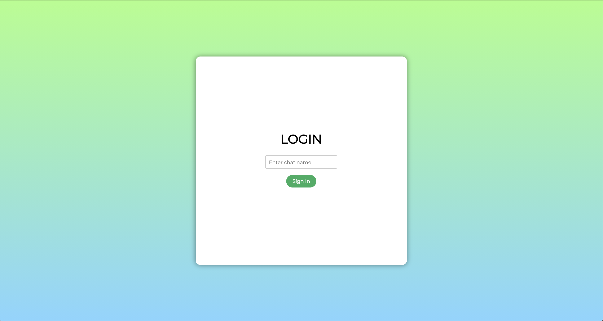

## RSA-Chat

A web chat implemented using React.js, Redux, WebSockets and the RSA algorithm.

The chat uses the Miller-Rabin primality test for generating at least 128 bit prime numbers for private and public key generation. For instance, the chat will show the encrypted message whenever it is sent.

